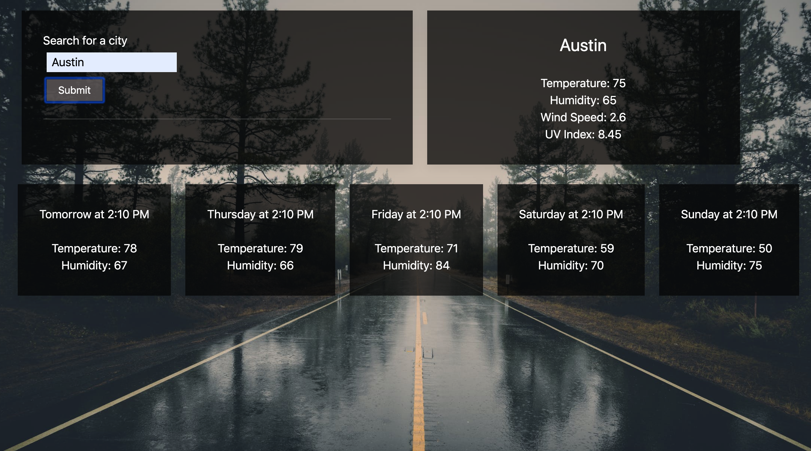

# Weather Dashboard

Want to know the weather this week?? 

https://kimiinglet.github.io/weatherDashboard/

## Here I have created a weather app with UIKit.

## What is used:
- Open Weather API
    - todays forecast
    - 5day forecast

- Moment.js
    - 5 day forecast Days

## Things in progress:
- adding local storage
- getting location from browser
- adding popular cities as buttons
- clean up code (Always learning to clean up code)

